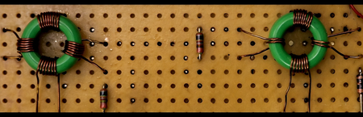

# Induction-Coupling Architecture (ICA)

Induction-Coupling Architecture (ICA) is an experimental hardware-oriented computing framework that explores computation through controlled electromagnetic coupling rather than conventional transistor-based switching.

ICA integrates two primary research components:

- IDL — Induction-Based Digital Logic
- IAS — Induction-Based Adaptive Synapse

The objective is to investigate both deterministic logic primitives and adaptive hardware mechanisms using inductive coupling principles.
## Prototype Component

Example inductive element used in experimental setup:

---

## Architecture Components

### 1. IDL — Induction-Based Digital Logic

IDL explores the construction of digital logic primitives using inductive interactions between circuit elements.

Demonstrated prototypes:

- Induction-based NOT gate  
- Induction-based NAND gate  
- Induction-based NOR gate  
- 1-bit binary adder constructed from induction-based logic primitives  

These validate the feasibility of deterministic logic formation using controlled inductive coupling.

---

### 2. IAS — Induction-Based Adaptive Synapse

IAS investigates adaptive coupling behavior inspired by synaptic mechanisms in biological systems.

Prototype-stage implementation includes:

- Experimental induction-based synapse element
- Adjustable coupling response behavior
- Hardware-level adaptation concept exploration

This component explores the possibility of hardware-level adaptive computation within the ICA framework.

---

## Research Direction

Current focus areas:

- Scaling induction-based logic structures
- Stability and signal integrity analysis
- Controlled adaptive coupling mechanisms
- Architecture-level abstraction for hybrid deterministic and adaptive systems

---

## Research Stage

ICA is currently in the **experimental prototype phase**.

The work validates core hardware principles before advancing toward larger architectural integration.

---

## Disclaimer

ICA is an exploratory hardware research initiative investigating alternative physical computing mechanisms.  
It does not claim replacement of existing computing architectures.

---

## Author

Sridhar R  
Independent Researcher  
